<div align="center">



<p>
  <a href="https://abubakr-code.github.io"></a>
  <a href="https://github.com/Abubakr-code/armorix/releases/latest"></a>
  <a href="https://greencodeai.uz"></a>
</p>

</div>

## 👋 Men haqimda · Обо мне · About me

<details open>
<summary><b>🇺🇿 O'zbekcha</b></summary>
<br>

Salom! Men **Abubakr** — O'zbekistondan **full-stack dasturchi** va **kiberxavfsizlik mutaxassisi**.
Veb-ilovalarni boshidan oxirigacha quraman va ularni xakerdan oldin buzib ko'raman.

- 🛡️ **[Armorix](https://github.com/Abubakr-code/armorix)** asoschisiman — kodni **internetsiz** tekshiradigan va lokal AI bilan tuzatadigan auditor
- 🔍 Yo'nalishim: AppSec, statik kod tahlili (SAST), secure code review, DevSecOps
- 🧠 Lokal LLM'lar: Ollama / llama.cpp bilan oflayn AI — kod kompyuterdan chiqmaydi
- 🌐 3D veb: React, Three.js, GSAP — [saytimni ko'ring](https://abubakr-code.github.io)
- 🚀 Hozir: Armorix'ni UzCombinator 2026 ga tayyorlayapman

</details>

<details>
<summary><b>🇷🇺 Русский</b></summary>
<br>

Привет! Я **Абубакр** — **full-stack разработчик** и **специалист по кибербезопасности** из Узбекистана.
Создаю веб-приложения от начала до конца и ломаю их раньше, чем это сделают хакеры.

- 🛡️ Основатель **[Armorix](https://github.com/Abubakr-code/armorix)** — аудитор кода, который проверяет **без интернета** и исправляет уязвимости локальным ИИ
- 🔍 Направления: AppSec, статический анализ (SAST), secure code review, DevSecOps
- 🧠 Локальные LLM: офлайн-ИИ на Ollama / llama.cpp — код не покидает компьютер
- 🌐 3D-веб: React, Three.js, GSAP — [мой сайт](https://abubakr-code.github.io)
- 🚀 Сейчас: готовлю Armorix к UzCombinator 2026

</details>

<details>
<summary><b>🇬🇧 English</b></summary>
<br>

Hi! I'm **Abubakr** — a **full-stack developer** and **cybersecurity specialist** from Uzbekistan.
I build web apps end to end and break them before attackers do.

- 🛡️ Founder of **[Armorix](https://github.com/Abubakr-code/armorix)** — an offline code auditor that finds vulnerabilities and fixes them with a local AI
- 🔍 Focus: AppSec, static analysis (SAST), secure code review, DevSecOps
- 🧠 Local LLMs: offline AI with Ollama / llama.cpp — code never leaves the machine
- 🌐 3D web: React, Three.js, GSAP — [see my site](https://abubakr-code.github.io)
- 🚀 Now: getting Armorix ready for UzCombinator 2026

</details>

## 🛡️ Asosiy loyiha · Главный проект · Featured

<a href="https://github.com/Abubakr-code/armorix"></a>

<div align="center">

**8** til · языков · languages — JavaScript · TypeScript · Python · PHP · Go · Java · C · C++ &nbsp;|&nbsp;
**39** qoida · правил · rules &nbsp;|&nbsp; **253,924** CVE &nbsp;|&nbsp; **0** bayt · байт · bytes → internet

</div>

```bash
curl -fsSL https://abubakr-code.github.io/install.sh | sh     # Linux · macOS · Kali
irm https://abubakr-code.github.io/install.ps1 | iex          # Windows
```

## 🧰 Texnologiyalar · Технологии · Tech stack

<p align="center">
  <br>
  
</p>

<p align="center">
  
  
  
  
  
  
</p>

## 📊 Statistika · Статистика · Stats

<p align="center">
  
  
</p>

<picture>
  <source media="(prefers-color-scheme: dark)" srcset="https://raw.githubusercontent.com/Abubakr-code/Abubakr-code/output/snake-dark.svg">
  
</picture>

<div align="center">
<sub>Kartalar har 6 soatda o'zi yangilanadi · Карточки обновляются каждые 6 часов · Cards refresh every 6 hours</sub>
</div>
